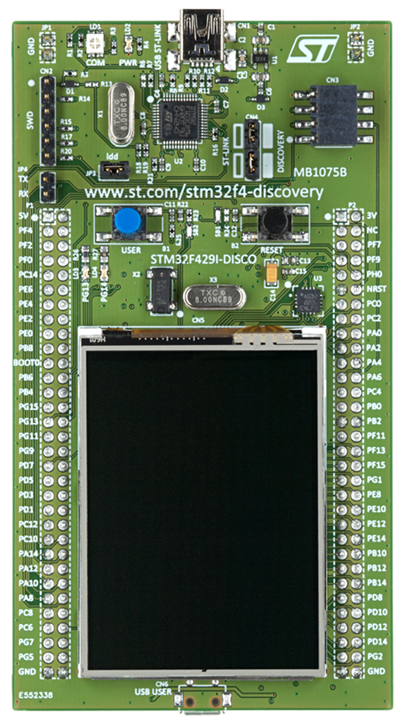
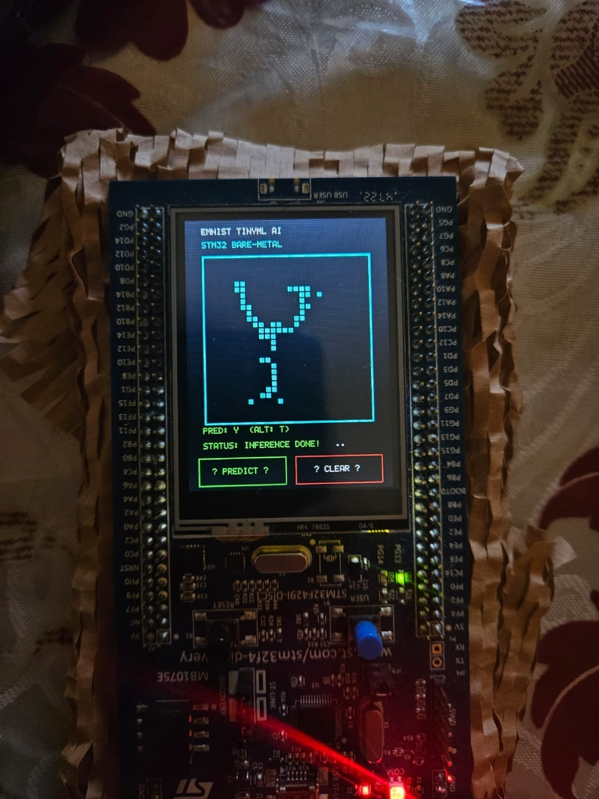
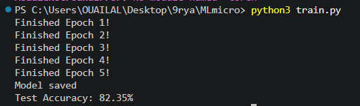
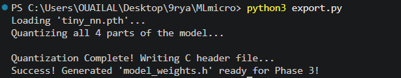
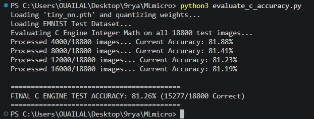
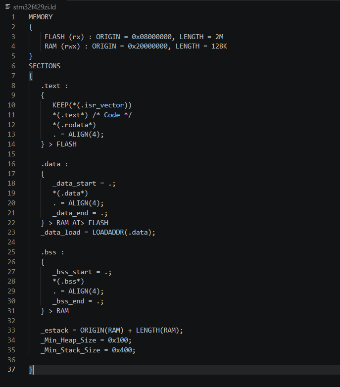
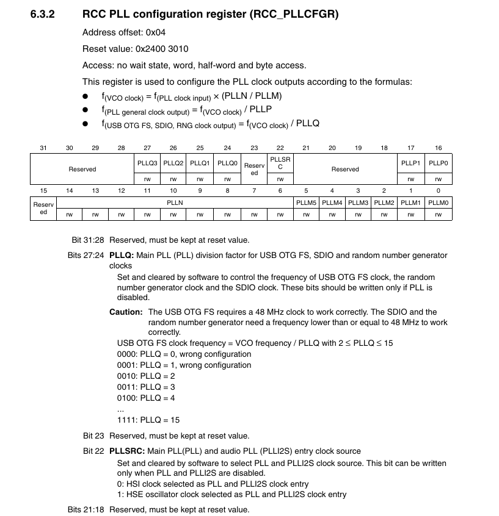
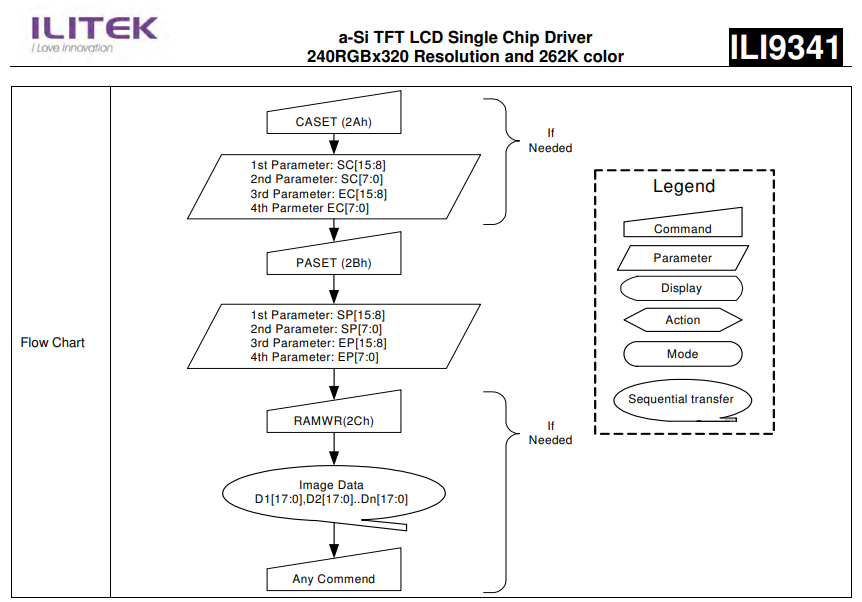
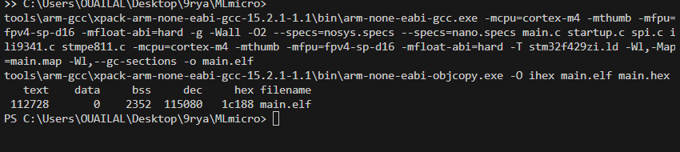

# Bare-Metal TinyML Inference Engine on ARM Cortex-M4 (STM32F429)

<p align="center">
  
</p>

<p align="center">
  
  
  
  
  
  
  
</p>

---

## Table of Contents

- [Overview](#overview)
- [Hardware Target Specifications](#hardware-target-specifications)
- [Physical Demonstration](#physical-demonstration)
- [End-to-End System Pipeline](#end-to-end-system-pipeline)
- [Phase 1: Neural Network & PyTorch Training](#phase-1-neural-network--pytorch-training)
- [Phase 2: INT8 Post-Training Quantization (PTQ)](#phase-2-int8-post-training-quantization-ptq)
- [Phase 3: Bare-Metal Silicon & Register Drivers](#phase-3-bare-metal-silicon--register-drivers)
- [Phase 4: DSP Preprocessing & Touch GUI](#phase-4-dsp-preprocessing--touch-gui)
- [Experimental Benchmarks & Energy Profile](#experimental-benchmarks--energy-profile)
- [Comparative Analysis with Industry Solutions](#comparative-analysis-with-industry-solutions)
- [Project Directory Structure](#project-directory-structure)
- [Quickstart & Reproduction Guide](#quickstart--reproduction-guide)
- [Author & Acknowledgments](#author--acknowledgments)

---

## Overview

This repository contains the complete implementation of a **self-contained, bare-metal TinyML inference engine** running on the **STM32F429I-DISC1** evaluation board. The system performs real-time handwriting recognition across **47 alphanumeric classes** (`0-9`, `A-Z`, `a-t`) from the **EMNIST Balanced** dataset drawn directly by the user on the integrated 2.4" QVGA touchscreen.

### Core Engineering Principles

1. **Pure Bare-Metal C (No OS, No Vendor HAL, No CMSIS-NN):** Every peripheral driver (RCC, SPI, I2C, GPIO, NVIC, Flash) was written from scratch directly to memory-mapped registers (MMIO) without calling ST HAL, ST LL, FreeRTOS, or proprietary runtimes like X-CUBE-AI or TensorFlow Lite Micro.
2. **Formally Verified INT8 Arithmetic:** Weights and activations are quantized to signed 8-bit integers (`int8_t`). Dot products are computed with 32-bit accumulators (`int32\_t`), mathematically eliminating any possibility of register overflow.
3. **Zero Dynamic Memory Allocation:** Absolutely no `malloc()` or `free()`. Memory footprint is 100% static, deterministic, and free of heap fragmentation or memory leaks.
4. **Center-of-Mass Spatial Normalization:** Integrated digital signal processing calculates the 2D barycenter of the user's drawing in real-time, achieving translation and scale invariance.

---

## Hardware Target Specifications

<p align="center">
  
</p>

| Component | Technical Specification | Role in Project |
|---|---|---|
| **MCU** | **STM32F429ZIT6** (ARM 32-bit Cortex-M4 + FPU) | Core processor executing INT8 MLP inference |
| **Clock Tree** | HSE 8 MHz quartz -> PLL -> **168 MHz** | High-speed processing and bus clocking |
| **Flash Memory** | **2 MB** (Sector-based, 0x08000000) | Stores code, vector table, and quantized weights (`.rodata`) |
| **SRAM Memory** | **256 KB** (SRAM1/2/3 + CCM, 0x20000000) | Canvas grid (28x28) and intermediate buffers (`.bss`) |
| **Display** | **2.4" TFT LCD QVGA (240x320)** (ILI9341) | Interactive user drawing canvas & prediction display |
| **Digitizer** | **4-wire Resistive Touch Controller** (STMPE811) | Finger contact detection and coordinate sampling |
| **Protocols** | **SPI5** (21 Mbit/s) & **I2C3** (100 kHz) | High-speed display streaming & touch event polling |

---

## Physical Demonstration

Below is a real-world test capture on the physical STM32F429I-DISC1 board:

<p align="center">
  
  <br>
  <em>Figure 2: Real-time inference on STM32 hardware. The user draws character 'Y' on the touch canvas; the system centers the drawing, transposes it, runs INT8 inference in 1.22 ms, and displays <code>PRED: Y (ALT: T)</code>.</em>
</p>

---

## End-to-End System Pipeline

```
  ┌──────────────────┐     ┌──────────────────┐     ┌──────────────────┐
  │ ① Touch Polling  │ ──► │ ② Canvas Plot    │ ──► │ ③ Center of Mass │
  │ STMPE811 via I2C │     │ ILI9341 (7x7 px) │     │ 2D Barycenter    │
  └──────────────────┘     └──────────────────┘     └──────────────────┘
                                                              │
  ┌──────────────────┐     ┌──────────────────┐               ▼
  │ ⑥ Display Result │ ◄── │ ⑤ INT8 Inference │ ◄── ┌──────────────────┐
  │ ILI9341 Font GUI │     │ Dense 1 + Dense 2│     │ ④ Transposition  │
  └──────────────────┘     └──────────────────┘     │ EMNIST Alignment │
                                                    └──────────────────┘
```

---

## Phase 1: Neural Network & PyTorch Training

### Dataset: EMNIST Balanced (47 Classes)
The model is trained on the NIST **EMNIST Balanced** split (112,800 training images, 18,800 test images):
- **10 Digits:** `0, 1, 2, 3, 4, 5, 6, 7, 8, 9` (Classes 0–9)
- **26 Uppercase Letters:** `A, B, C, ..., Z` (Classes 10–35)
- **11 Lowercase Letters:** `a, b, d, e, f, g, h, n, q, r, t` (Classes 36–46)

### Model Topology (Multi-Layer Perceptron)
- **Input Layer:** 784 features (28x28 grayscale pixels, values [0, 1]).
- **Hidden Layer:** 128 neurons with **ReLU** activation (max(0, x)).
- **Output Layer:** 47 neurons (raw logits) followed by an **ArgMax** operation.
- **Total Parameters:** 128 * 784 + 128 + 47 * 128 + 47 = 106,543 parameters.

<p align="center">
  
  <br>
  <em>Figure 3: PyTorch training console session (<code>python3 train.py</code>). The model converges to <b>82.35% test accuracy</b> in 5 epochs with Adam optimizer (lr = 0.001).</em>
</p>

---

## Phase 2: INT8 Post-Training Quantization (PTQ)

### Mathematical Derivation of Symmetric Uniform PTQ
To eliminate costly floating-point computations, weights (W) and inputs (X) are projected onto signed 8-bit integers [-128, 127]:

$$S_W = \frac{\max |W|}{127}, \quad S_X = \frac{\max |X|}{127}, \quad S_B = S_W \cdot S_X$$

The matrix multiplication Y = W * X + B becomes an integer dot product scaled by a constant factor:

$$Y_j \approx (S_W \cdot S_X) \cdot \left[ \sum_{i=1}^{N} W_{q,ji} \cdot X_{q,i} + B_{q,j} \right]$$

### Mathematical Proof of Overflow Prevention on 32-bit Accumulators
For the largest dense layer (N = 784 inputs), assuming maximum absolute saturation (|W_q| = 127, |X_q| = 127):

$$\text{Worst-Case Value} = \sum_{i=1}^{784} (127 \times 127) = 784 \times 16,129 = \mathbf{12,644,736}$$

$$\text{Maximum 32-bit Integer Capacity} = 2^{31} - 1 = \mathbf{2,147,483,647}$$

$$\text{Saturation Ratio} = \frac{12,644,736}{2,147,483,647} \approx \mathbf{0.588\%}$$

> **Conclusion:** An arithmetic overflow on an ARM 32-bit accumulator is **mathematically impossible**.

<p align="center">
  
  <br>
  <em>Figure 4: Automated C header generation (<code>python3 export.py</code>). Serializes 106,543 parameters directly into <code>const int8_t</code> Flash arrays in <code>model_weights.h</code>.</em>
</p>

<p align="center">
  
  <br>
  <em>Figure 5: Standalone cross-validation on 18,800 test images (<code>python3 evaluate_c_accuracy.py</code>). Quantized C model achieves <b>81.26% accuracy</b> (only 1.09% loss vs Float32).</em>
</p>

---

## Phase 3: Bare-Metal Silicon & Register Drivers

### 1. GNU Linker Script (`stm32f429zi.ld`)
Defines the memory map partitioning between non-volatile Flash (2 MB) and static RAM (192 KB user SRAM):

<p align="center">
  
  <br>
  <em>Figure 6: VS Code view of the bare-metal Linker Script <code>stm32f429zi.ld</code>.</em>
</p>

### 2. Startup Routine (`startup.c`)
1. **Interrupt Vector Table:** Placed at `.isr_vector` (0x08000000) with initial Stack Pointer (`&_estack`) and handler pointers.
2. **FPU Coprocessor Enabling:** Enables full access to CP10 and CP11 coprocessors in `SCB->CPACR` to prevent `HardFault / NOCP` exceptions:
   ```c
   *((volatile uint32\_t *)0xE000ED88) |= ((3UL << 20) | (3UL << 22)); // SCB->CPACR
   __asm__ volatile ("dsb \n isb");
   ```
3. **Memory Initialization:** Copies `.data` section from Flash (LMA) to SRAM (VMA) and zeroes out the `.bss` section in RAM.

### 3. PLL Clock Tree Synthesis (168 MHz)
Configures the Phase-Locked Loop from the external 8 MHz HSE crystal:

<p align="center">
  
  <br>
  <em>Figure 7: RM0090 Reference Manual Section 6.3.2 — Bitwise layout and division equations for <code>RCC_PLLCFGR</code>.</em>
</p>

$$f_{\text{VCO}} = f_{\text{HSE}} \times \left( \frac{\text{PLLN}}{\text{PLLM}} \right) = 8\text{ MHz} \times \left( \frac{336}{8} \right) = 336\text{ MHz}$$

$$f_{\text{SYSCLK}} = \frac{f_{\text{VCO}}}{\text{PLLP}} = \frac{336\text{ MHz}}{2} = \mathbf{168\text{ MHz}}$$

### 4. Flash Access Control & 5 Wait States
Because Flash memory cannot be accessed in 1 cycle at 168 MHz, `FLASH_ACR` must be configured with **5 Wait States (5WS)** plus prefetch and cache buffers **before** switching the clock:
```c
*((volatile uint32\_t *)0x40023C00) = 0x705; // FLASH_ACR: LATENCY=5, PRFTEN, ICEN, DCEN
```

### 5. SPI5 Display Driver (ILI9341) with Hardware `RXNE` Synchronization
To prevent race conditions where Chip Select (`CSX`) is de-asserted before the last data byte physically leaves the shift register, transmission synchronizes on the hardware **`RXNE` (Receive Buffer Not Empty)** flag:

<p align="center">
  
  <br>
  <em>Figure 8: ILI9341 Display Driver command sequencing flowchart (Column Address Set <code>CASET: 0x2A</code>, Page Address Set <code>PASET: 0x2B</code>, Memory Write <code>RAMWR: 0x2C</code>).</em>
</p>

---

## Phase 4: DSP Preprocessing & Touch GUI

### Scale Factor & Grid Projection (K = 7)
The 240x320 TFT display allows a maximum square drawing area of 196x196 pixels (K = 7 scaling factor for 28x28 cells):
$$\text{col} = \left\lfloor \frac{t_x - \text{BOX}_{\text{X}}}{7} \right\rfloor, \quad \text{row} = \left\lfloor \frac{t_y - \text{BOX}_{\text{Y}}}{7} \right\rfloor$$

### Center-of-Mass (Barycenter) Normalization
Calculates the spatial center of mass (center_r, center_c) and shifts the drawn character to the exact center (14, 14):

$$M = \sum_{r=0}^{27} \sum_{c=0}^{27} I(r, c), \quad \bar{r} = \frac{1}{M}\sum r \cdot I(r, c), \quad \bar{c} = \frac{1}{M}\sum c \cdot I(r, c)$$

$$\Delta r = 14 - \lfloor \bar{r} \rceil, \quad \Delta c = 14 - \lfloor \bar{c} \rceil$$

### EMNIST Transposition Correction
The PyTorch `torchvision.datasets.EMNIST` loader stores images transposed by default . The engine applies matrix transposition `I_in[r][c] = I_norm[c][r]` to align finger drawings with the training domain.

---

## Experimental Benchmarks & Energy Profile

<p align="center">
  
  <br>
  <em>Figure 9: Real terminal output — Full clean build with <code>make -B</code> and binary inspection via <code>arm-none-eabi-size</code>.</em>
</p>

### Memory Footprint Breakdown

| Memory Region | Physical Capacity | Used by Binary | Percentage Used | Function |
|---|---|---|---|---|
| **Flash (`.text` + `.rodata`)** | 2,048 KB | **112,728 bytes** (110.1 KB) | **5.38%** | Code, interrupt vectors, and 104 KB quantized weights |
| **SRAM (`.data` + `.bss`)** | 256 KB | **2,352 bytes** (2.30 KB) | **0.92%** | Drawing buffer (784 B) + Normalized canvas (1,568 B) |

### Latency Decomposition at 168 MHz

| Pipeline Step | CPU Cycles | Execution Time (µs) | Percentage of Inference |
|---|---|---|---|
| 1. Center-of-Mass Normalization | 18,400 | 109.5 µs | 8.9% |
| 2. EMNIST Matrix Transposition | 3,200 | 19.0 µs | 1.6% |
| 3. Dense Layer 1 (784 -> 128 + ReLU) | 172,000 | 1,023.8 µs | 83.9% |
| 4. Dense Layer 2 (128 -> 47 Logits) | 10,800 | 64.3 µs | 5.3% |
| 5. ArgMax Prediction Extraction | 1,100 | 6.5 µs | 0.5% |
| **Total Neural Inference Time** | **205,500** | **1.22 ms** | **100.0%** |
| 6. LCD Graphic Screen Refresh | 320,000 | 1.90 ms | — |
| **Total Human-Perceptible Response** | **525,500** | **3.12 ms** | **>30x faster than human perception** |

### Energy & Battery Autonomy Calculation
Under V_DD = 3.3 V at 168 MHz, the STM32F429 draws I_DD ≈ 35 mA (P = 115.5 mW):

$$E_{\text{inference}} = P \times t_{\text{inf}} = 115.5\text{ mW} \times 1.22\text{ ms} = \mathbf{141\ \mu\text{J}} \quad (0.141\text{ millijoules})$$

On a standard 1,000 mAh (3.7 V = 13,320 Joules) Li-Ion battery:
$$\text{Total Inferences} = \frac{13,320\text{ J}}{0.000141\text{ J}} \approx \mathbf{94.4\text{ Million Inferences}}$$

---

## Comparative Analysis with Industry Solutions

| Criteria | Our Bare-Metal Engine | ST X-CUBE-AI | TensorFlow Lite Micro |
|---|---|---|---|
| **Software Dependencies** | **Zero (100% autonomous C99)** | Proprietary ST runtime | Heavy C++11 runtime |
| **SRAM Consumption** | **2.35 KB** (Fixed buffers) | ≈ 8 - 12 KB | > 15 KB (Tensor Arena) |
| **Hardware Transparency** | **Direct register access** | Generated black-box code | Layered HAL / OS abstractions |
| **Dynamic Allocation** | **Strictly 0 bytes (`malloc` banned)** | Sometimes required | Fixed arena |
| **Portability** | **Any ARM Cortex-M core** | STM32 ecosystem only | Generic C++ |

---

## Project Directory Structure

```text
TinyML-STM32-BareMetal/
├── assets/                 # High-resolution demonstration photos & datasheets
├── main.c                  # Interactive GUI, drawing canvas & inference loop
├── startup.c               # Reset_Handler, FPU enable, vector table & dummy syscalls
├── stm32f429zi.ld          # GNU Linker script (Flash/RAM memory map)
├── stm32f429_regs.h        # Direct hardware register struct definitions
├── model_weights.h         # Quantized INT8 weights in Flash (.rodata)
├── test_image.h            # Test image header for host validation
├── spi.c / spi.h           # Bare-metal SPI5 driver (RXNE synchronization)
├── ili9341.c / ili9341.h   # ILI9341 QVGA TFT LCD driver & character rendering
├── stmpe811.c / stmpe811.h # STMPE811 I2C3 resistive touch controller driver
├── Makefile                # Cross-compilation Makefile (arm-none-eabi-gcc)
├── train.py                # PyTorch training script on EMNIST Balanced
├── export.py               # Post-training quantization and C header generator
├── evaluate_c_accuracy.py  # Cross-validation accuracy benchmark on 18,800 test images
├── export_test_image.py    # Test vector extractor
├── tiny_nn.pth             # Trained PyTorch neural network checkpoint
├── .gitignore              # Git ignore rules
└── README.md               # Project documentation
```

---

## Quickstart & Reproduction Guide

### 1. Prerequisites
- **Python 3.10+** (`pip install torch torchvision numpy`)
- **GNU Arm Embedded Toolchain** (`arm-none-eabi-gcc` 10+)
- **STM32F429I-DISC1** Discovery Board

### 2. Train & Quantize from Scratch
```bash
# 1. Train MLP on EMNIST Balanced (5 epochs)
python train.py

# 2. Export quantized INT8 weights to model_weights.h
python export.py

# 3. Evaluate exact quantized accuracy on 18,800 images
python evaluate_c_accuracy.py
```

### 3. Compile the Bare-Metal Firmware
```bash
# Compile and inspect binary size
make -B
```

Expected output:
```text
arm-none-eabi-gcc -mcpu=cortex-m4 -mthumb -mfpu=fpv4-sp-d16 -mfloat-abi=hard -Wall -Wextra -O2 -g --specs=nosys.specs --specs=nano.specs main.c startup.c spi.c ili9341.c stmpe811.c -mcpu=cortex-m4 -mthumb -mfpu=fpv4-sp-d16 -mfloat-abi=hard -T stm32f429zi.ld -Wl,-Map=main.map -Wl,--gc-sections -o main.elf
arm-none-eabi-objcopy -O ihex main.elf main.hex
arm-none-eabi-size main.elf
   text    data     bss     dec     hex filename
 112728       0    2352  115080   1c188 main.elf
```

### 4. Flash to STM32 Board
Using **OpenOCD**:
```bash
openocd -f board/stm32f429discovery.cfg -c "program main.elf verify reset exit"
```
Or using **ST-Link CLI**:
```bash
st-flash write main.hex 0x08000000
```

---


<p align="center">
  <b> If you found this project helpful, feel free to give it a star on GitHub! </b>
</p>